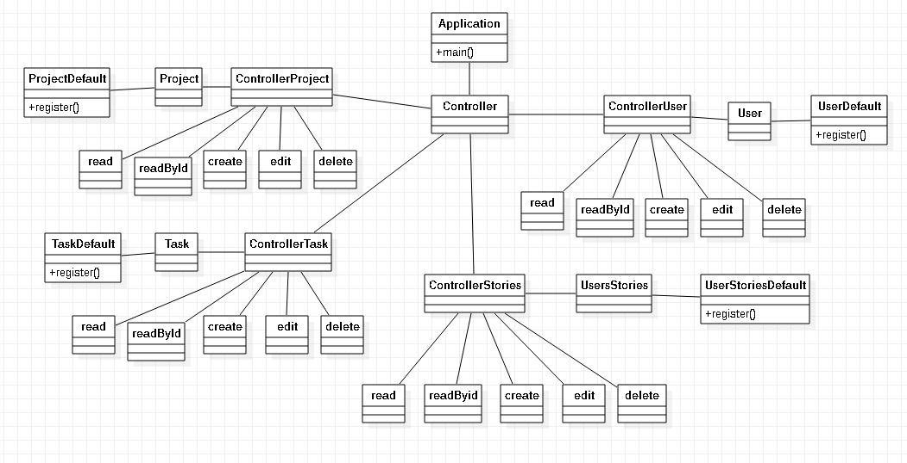
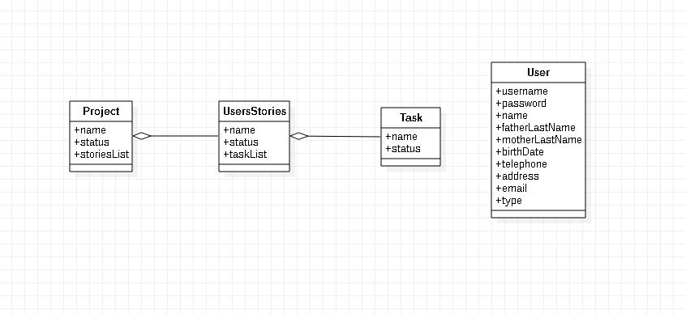
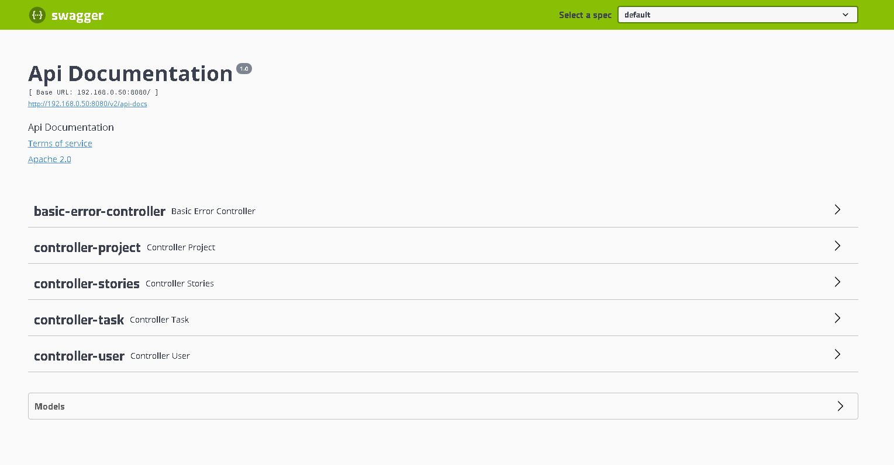
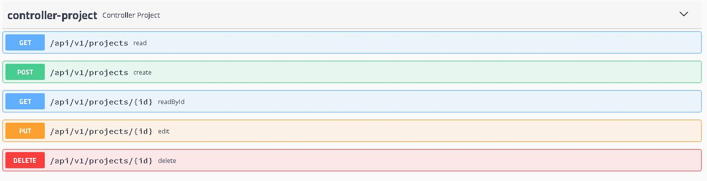
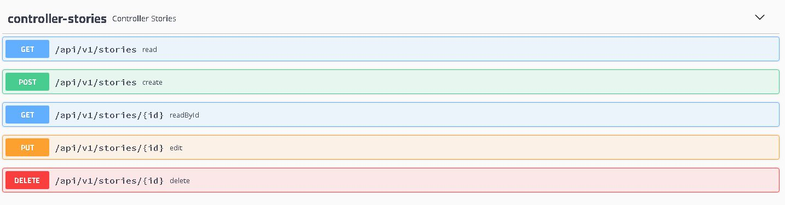
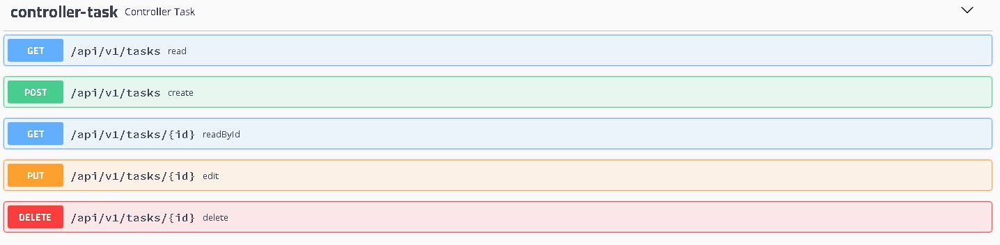
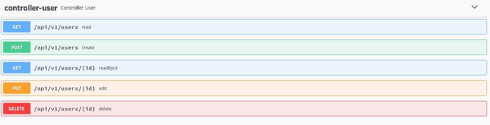
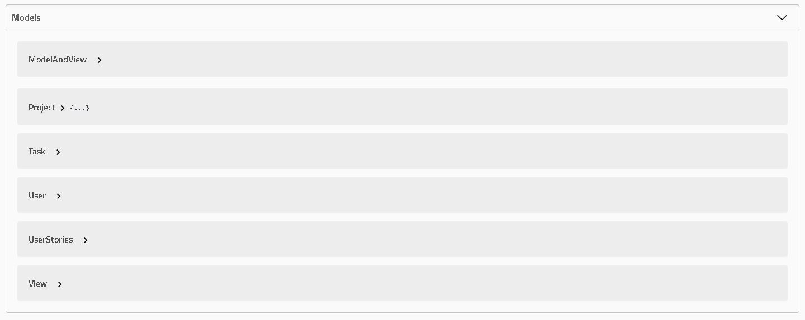

# java-spring-todo

This project is a projects management system, it has Swagger in order to see all the endpoints and models.

## Prerequisites 🔨

1. Install Windows 10
2. Install gradle-6.4.1
3. Install java 1.8.0_201

## Deploy 🚀

1. gradlew build
2. configure build/resources/main/application.properties
3. java -jar build/libs/java-spring-todo.jar

## Diagrams

#### Clases

<p align="center">
  
</p>

#### Models

<p align="center">
  
</p>

#### Swagger Example:

```
http://localhost:8080/swagger-ui.html
```

<p align="center">
  
</p>

#### Swagger Controller Project:

<p align="center">
  
</p>

#### Swagger Controller Stories:

<p align="center">
  
</p>

#### Swagger Controller Task:

<p align="center">
  
</p>

#### Swagger Controller User:

<p align="center">
  
</p>

#### Swagger Models:

<p align="center">
  
</p>

#### API:

#### Users:

```
GET localhost:8080/api/v1/users
GET localhost:8080/api/v1/users/{id}
POST localhost:8080/api/v1/users
PUT localhost:8080/api/v1/users/{id}
DELETE localhost:8080/api/v1/users/{id}

{
  "username": "micky",
  "password": "micky123",
  "name": "miguel",
  "fatherLastName": "aguilar",
  "motherLastName": "paredes",
  "birthDate": "10-10-2010",
  "telephone": 77845214,
  "address": "Blanco galindo km6",
  "email": "micky14@gmail.com",
  "type": "Developer"
}
```

#### Tasks:

```
GET localhost:8080/api/v1/tasks
GET localhost:8080/api/v1/tasks/{id}
POST localhost:8080/api/v1/tasks
PUT localhost:8080/api/v1/tasks/{id}
DELETE localhost:8080/api/v1/tasks/{id}

{
  "name": "mostrar usuarios",
  "status": "todo"
}
```

#### Stories:

```
GET localhost:8080/api/v1/stories
GET localhost:8080/api/v1/stories/{id}
POST localhost:8080/api/v1/stories
PUT localhost:8080/api/v1/stories/{id}
DELETE localhost:8080/api/v1/stories/{id}

{
  "name": "Modulo de usuarios",
  "status": "todo"
}
```

{
  "name": "Modulo de usuarios",
  "status": "todo",
  "taskList": [
    {
      "name": "mostrar usuarios",
      "status": "todo"
    },
    {
      "name": "Registrar usuarios",
      "status": "todo"
    },
    {
      "name": "Eliminar usuarios",
      "status": "todo"
    },
    {
    "name": "Modificar usuarios",
    "status": "todo"
    }
  ]
}
```

#### Projects:

```
GET localhost:8080/api/v1/projects
GET localhost:8080/api/v1/projects/{id}
POST localhost:8080/api/v1/projects
PUT localhost:8080/api/v1/projects/{id}
DELETE localhost:8080/api/v1/projects/{id}

{
  "name": "Sistema de ventas.",
  "status": "todo"
}
```

{
  "name": "Sistema de ventas.",
  "status": "todo",
  "storiesList": [
  {
    "name": "Modulo de usuarios",
    "status": "todo",
    "taskList": [
      {
        "name": "mostrar usuarios",
        "status": "todo"
      },
      {
        "name": "Registrar usuarios",
        "status": "todo"
      },
      {
        "name": "Eliminar usuarios",
        "status": "todo"
      },
      {
        "name": "Modificar usuarios",
        "status": "todo"
      }
    ]
  },
{
  "name": "Modulo de ventas",
  "status": "finished",
  "taskList": [
    {
      "name": "Mostrar ventas",
      "status": "inProgres"
    },
    {
      "name": "Registrar ventas",
      "status": "inProgres"
    },
    {
      "name": "Eliminar ventas",
      "status": "inProgres"
    },
        {
          "name": "Modificar ventas",
          "status": "inProgres"
        }
      ]
    }
  ]
}
```

## Contributing

1. Fork it!
2. Create your feature branch: `git checkout -b feature/1001`
3. Commit your changes: `git commit -m 'feature/1001: Add some feature'`
4. Push to the branch: `git push origin feature/1001`
5. Submit a pull request.

## License

- Free.
